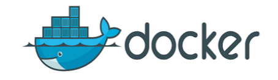

## Expose a NGinx docker image, build and run locally

### Building an image
We are going to use a super small Linux distribution called Alpine Linux with an Nginx HTTP server. 
Inside this folder we have a file called "Dockerfile" that is the base of our image.

Line 1 used `FROM` directive that references an existing image in the registry.
Line 2 used `COPY` directive to copy the contents of the `./site` folder to `/usr/share/nginx/html` inside of the container.

### Running an image

In order to run this example please clone the repository, then go to the folder repository. 

```sh
$ git clone https://github.com/twogg-git/docker-nginx.git && cd docker-nginx
```

Building, we are going to use -t flag to asing the name of the image. Build the image, executes every statement inside of the `Dockerfile` and overlays the resulting file system on top of the previous one.

```sh
$ docker build -t localnginx .
```

Listing docker images locally available, in this case *ginx*, the base image pulled from the registry thanks to the Dockerfile first line and *localnginx*, our version.

```sh
$ docker images
```

Create and start a container, we are going to use -p flag `-p 3111:80` to map the port 3111 in the host machine to the port 80 inside the container. Here we are attaching our runing console to the execution, tun the comand and go to `http://localhost:3111` to test the served page. Ctrl+C to exit the container console. 

```sh
$ docker container run -p 3111:80 localnginx 
```

Listing containers, this command will list all running containers, if you add the -a flag it will list all the container not matter their status. One of those containers will be our localnginx.  

```sh
$ docker container ls -a
```

Now start again our container and test `http://localhost:3111`. It will we available in the same port, but in this case the console will remain deattach. 

```sh
$ docker container start <container_id>
```

Each time you use the run command Docker will create a new container based, for example if you run the following command it will create a second localnginx image based container. If you want to list use `-a flag` because now is on Exited status. Use `start` command to start again that Exited container using the Container Id as a parameter. Finally if you want to errase a container use `rm` command, `-f flag` will delete that container even if is running.

```sh
$ docker container run -p 3222:80 localnginx 
$ docker container ls -a
$ docker container start <container_id>
$ docker rm -f <container_id>
```

Runing a container setting the name and deattach mode, to set a name to our container we use `--name option` and then `-d flag` to deattach the container from the console. Another useful commands are stop and star. 
```sh
$ docker container run -p 3333:80 --name localnginx -d localnginx 
$ docker container ls 
$ docker container stop localnginx
$ docker container start localnginx
```

Container logs, an important tool available in Docker is `logs command`. If we run the following command we are getting access to the logs of our localnginx. 
```sh
$ docker logs localningx
```

Container inspect, if you want to know your container `current ip`, open ports, based image, or any low-level information in your Docker object use the `inspect command`.
```sh
$ docker inspect localnginx
```

Next step is working with a volumne, an external resource outside our container. We are going to use the html file located inside `external-site folder`, so each time we change our page content it will reflected in the runing container. (Don't forget to change the folder's path). This time test `http://localhost:3444` and change /external-site/index.html and refresh your browser.

```sh
$ docker container run -p 3444:80 -d --name externalsite -v /<Your_folder_path>/docker-nginx/external-site:/usr/share/nginx/html localnginx
```

### Working inside a container

```sh
$ docker run --name ubuntubash --rm -i -t ubuntu:rolling bash
```

docker run --name ubuntubash -i -t -d ubuntu:rolling 

docker exec -it ubuntubash /bin/bash

docker attach ubuntubash 

docker start ubuntubash

### Useful commands

Some final useful commands, respectily, delete a container by id -f flag to force the command to include the running containers, next the one to *delete all containers*, rmi command is for images so the thrid command will delete an image by id, the last one will delete all images, use that one wizely!.     
```sh
$ docker rm -f <container_id>
$ docker rm $(docker ps -a -q)
$ docker rmi -f <image_id>
$ docker rmi -f $(docker images -q)
```

